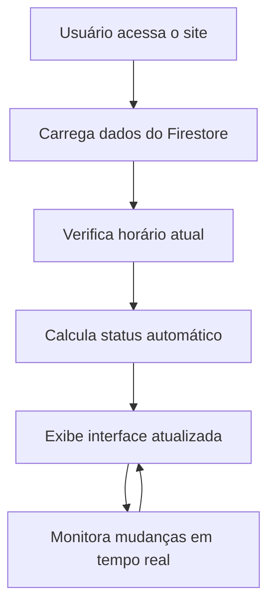
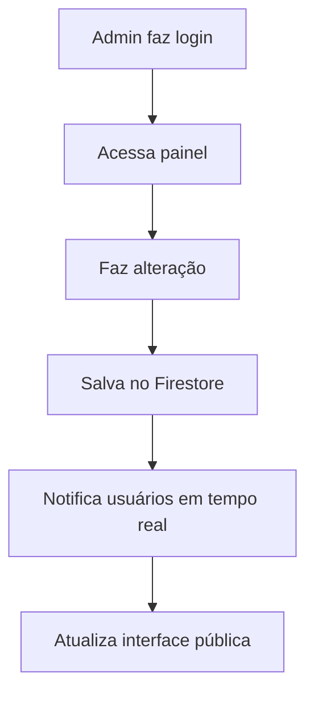

# 📋 Resumo do Projeto - Sistema de Gerenciamento do Laboratório UEFS

## 🎯 Objetivo do Projeto

O **Sistema de Gerenciamento do Laboratório de Computação da UEFS** foi desenvolvido para solucionar um problema real da universidade: a comunicação eficiente sobre o funcionamento do laboratório de computação. 

### 🚩 Problema Identificado
- **Falta de informação em tempo real** sobre o funcionamento do laboratório
- **Dificuldade de comunicação** para mudanças de horário ou manutenções
- **Necessidade de atualização manual** constante de avisos
- **Falta de acesso fácil** às informações para estudantes e professores

### ✨ Solução Desenvolvida
Uma aplicação web moderna que centraliza todas as informações do laboratório em uma interface intuitiva e responsiva, com atualizações em tempo real.

## 🔧 Arquitetura Técnica

### 🏗️ Modelo de Aplicação
- **SPA (Single Page Application)** desenvolvida em React
- **Arquitetura serverless** usando Firebase como backend
- **Frontend responsivo** com Tailwind CSS
- **TypeScript** para maior robustez e manutenibilidade

### 🌐 Infraestrutura
```
┌─────────────────┐    ┌──────────────────┐    ┌─────────────────┐
│   Usuários      │    │   Firebase       │    │   GitHub        │
│   (Web/Mobile)  │◄──►│   - Hosting      │◄──►│   - Repository  │
│                 │    │   - Firestore    │    │   - Actions     │
│                 │    │   - Auth         │    │   - Automation  │
└─────────────────┘    └──────────────────┘    └─────────────────┘
```

### 🎨 Frontend Stack
- **React 18** - Biblioteca principal
- **TypeScript** - Tipagem estática
- **Vite** - Build tool moderna e rápida
- **Tailwind CSS** - Framework CSS utilitário
- **Shadcn UI** - Componentes UI modernos
- **Lucide React** - Ícones consistentes

### 🔙 Backend Stack (Serverless)
- **Firebase Firestore** - Banco de dados NoSQL
- **Firebase Authentication** - Sistema de autenticação
- **Firebase Hosting** - Hospedagem estática
- **Firebase Security Rules** - Controle de acesso

## 📊 Funcionalidades Implementadas

### 🌍 Interface Pública
1. **Sistema de Reservas**
   - Visualização de todas as aulas agendadas
   - Exibição de horários livres (não reservados)
   - Formulário de solicitação de reserva para estudantes e professores
   - Status das reservas: Pendente, Aprovada, Rejeitada

2. **Calendário de Aulas e Disponibilidade**
   - Grid responsivo com horários da semana baseado no cronograma oficial
   - Distinção visual entre aulas reservadas e horários livres
   - Integração com dados do arquivo `cronograma_laboratorio_2025-2_Version2.xlsx`
   - Indicação de feriados e horários especiais

3. **Status em Tempo Real**
   - Indicador visual: Aberto 🟢 / Fechado 🔴 / Manutenção 🟡
   - Atualização automática baseada nos horários oficiais
   - Cálculo inteligente considerando feriados e reservas

4. **Sistema de Avisos**
   - Banner destacado para avisos especiais
   - Mensagens configuráveis pelos administradores
   - Avisos temporários para mudanças pontuais

### 🔐 Painel Administrativo
1. **Sistema de Autenticação**
   - Login seguro com Firebase Auth
   - Controle de acesso baseado em funções
   - Sessões seguras com tokens JWT

2. **Gestão de Reservas**
   - Aprovação/rejeição de solicitações de reserva
   - Visualização de dados completos das reservas:
     - Email institucional do solicitante
     - Nome da matéria e curso (para professores)
     - Data e horário solicitado
   - Histórico de reservas por usuário

3. **Sistema de Notificações**
   - Alertas quando novas reservas são solicitadas
   - Notificações para professores e alunos sobre status das reservas
   - Dashboard de atividades recentes

4. **Gestão de Status e Horários**
   - Alteração manual do status do laboratório
   - Override dos horários automáticos
   - Configuração de horários especiais e exceções
   - Gestão de feriados baseada no cronograma oficial

5. **Gerenciamento de Avisos**
   - Criação e edição de avisos especiais
   - Preview em tempo real
   - Programação de avisos temporários

6. **Histórico e Auditoria**
   - Log de todas as alterações e reservas
   - Rastreamento de usuários responsáveis
   - Timestamps de modificações e solicitações

## 🎯 Casos de Uso Principais

### 👨‍🎓 Estudantes
```
Como estudante, eu quero:
├── Ver todas as aulas que vão acontecer
├── Visualizar os horários que estão livres (não reservados pelos professores)
├── Solicitar reserva de horário (mesmo processo dos professores)
└── Entender que quando professores reservam é para aulas específicas
```

### 👩‍🏫 Professores
```
Como professor, eu quero:
├── Ver a disponibilidade para aulas
├── Solicitar reserva fornecendo:
    ├── Email institucional
    ├── Nome da matéria
    └── Curso
```

### 👨‍💼 Administradores
```
Como administrador, eu quero:
├── Confirmar reservas de professores e alunos
├── Ajustar horários e reservas
├── Publicar avisos urgentes
├── Modificar horários excepcionais
├── Controlar acesso ao sistema
├── Monitorar uso e alterações
└── Receber notificações quando professores/alunos fizerem reservas
```

## 📈 Benefícios Alcançados

### 🚀 Para os Usuários
- **Acesso 24/7** às informações do laboratório
- **Informações sempre atualizadas** em tempo real
- **Interface intuitiva** e fácil de usar
- **Compatibilidade total** com dispositivos móveis

### 💼 Para a Administração
- **Gestão centralizada** de todas as informações
- **Atualizações instantâneas** sem necessidade de suporte técnico
- **Redução de chamados** sobre funcionamento do laboratório
- **Controle de acesso** granular e seguro

### 🏫 Para a Universidade
- **Modernização** da comunicação institucional
- **Redução de custos** operacionais
- **Melhoria da experiência** estudantil
- **Transparência** nas informações

## 🔄 Fluxo de Funcionamento

### 📋 Fluxo Normal de Uso


### 🔧 Fluxo Administrativo


## 📊 Métricas e Performance

### ⚡ Performance Técnica
- **Primeiro carregamento**: < 2 segundos
- **Time to Interactive**: < 3 segundos
- **Bundle size**: ~190KB (gzipped)
- **Lighthouse Score**: 90+

### 📱 Compatibilidade
- **Responsividade**: 100% mobile-friendly
- **Browsers**: Chrome, Firefox, Safari, Edge
- **Dispositivos**: Desktop, tablet, smartphone
- **Acessibilidade**: ARIA labels implementadas

### 🔒 Segurança
- **HTTPS**: Obrigatório em produção
- **Firebase Rules**: Validação server-side
- **Autenticação**: JWT tokens seguros
- **Dados**: Criptografia em trânsito e repouso

## 🚧 Roadmap Futuro

### 📅 Próximas Funcionalidades
1. **Sistema de Reservas Avançado**
   - Reservas recorrentes para disciplinas
   - Sistema de confirmação automática baseado em critérios
   - Integração com calendário acadêmico da UEFS
   - Notificações por email para mudanças de status

2. **Dashboard Analítico**
   - Estatísticas de uso do laboratório
   - Relatórios de ocupação por período
   - Métricas de aprovação/rejeição de reservas
   - Análise de demanda por horários

3. **Integração Acadêmica**
   - Conexão com sistema acadêmico da UEFS
   - Validação automática de emails institucionais
   - Sincronização com disciplinas cadastradas
   - Import automático do cronograma oficial

4. **Aplicativo Mobile**
   - App nativo para iOS/Android
   - Notificações push para status de reservas
   - Modo offline para consulta de horários
   - Scanner QR para acesso rápido

### 🎯 Melhorias Planejadas
- **Performance**: Implementação de PWA completa
- **UX**: Animações e transições mais suaves
- **Acessibilidade**: Suporte completo a leitores de tela
- **Internacionalização**: Suporte a múltiplos idiomas

## 🛠️ Manutenção e Operação

### 🔄 Atualizações Automáticas
- **Deploy automático** via GitHub Actions
- **Monitoramento** contínuo da aplicação
- **Backups automáticos** do Firestore
- **Logs centralizados** para debugging

### 👥 Suporte e Documentação
- **Documentação completa** para desenvolvedores
- **Guias de usuário** para administradores
- **FAQ** para questões comuns
- **Canal de suporte** via GitHub Issues

## 📞 Informações de Contato

### 🛠️ Equipe Técnica
- **Desenvolvedor Principal**: [ElissonNadson](https://github.com/ElissonNadson)
- **Repositório**: [GitHub](https://github.com/ElissonNadson/Sistema-de-Gerenciamento-do-Laboratorio-UEFS)

### 🏛️ Instituição
- **Universidade**: Estadual de Feira de Santana - UEFS
- **Departamento**: Computação
- **Laboratório**: Laboratório de Computação

---

<div align="center">

**Sistema de Gerenciamento do Laboratório UEFS**

*Conectando tecnologia e educação para uma experiência universitária melhor*

**UEFS - Universidade Estadual de Feira de Santana**

</div>